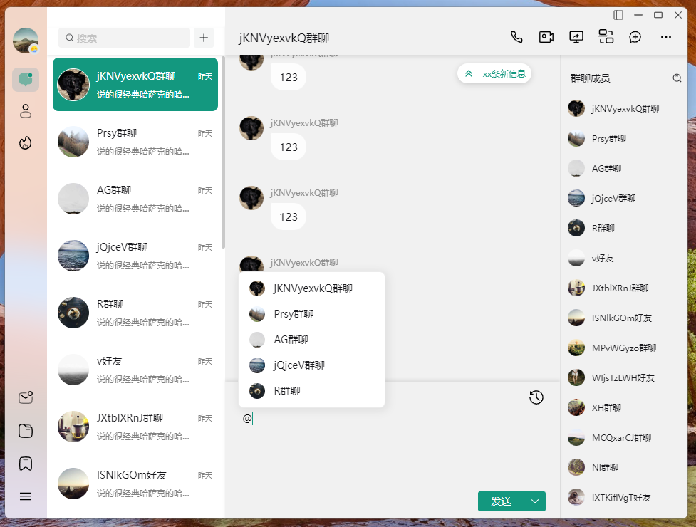
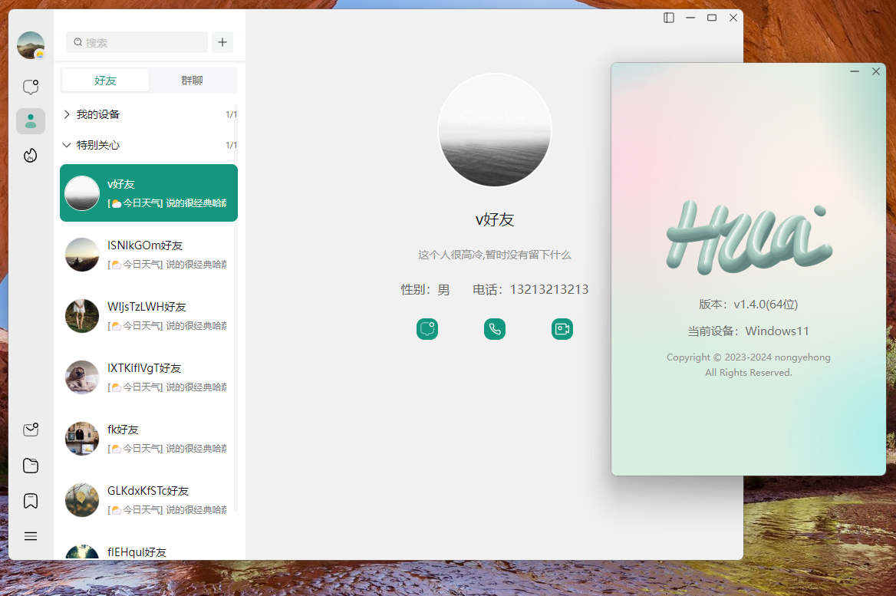
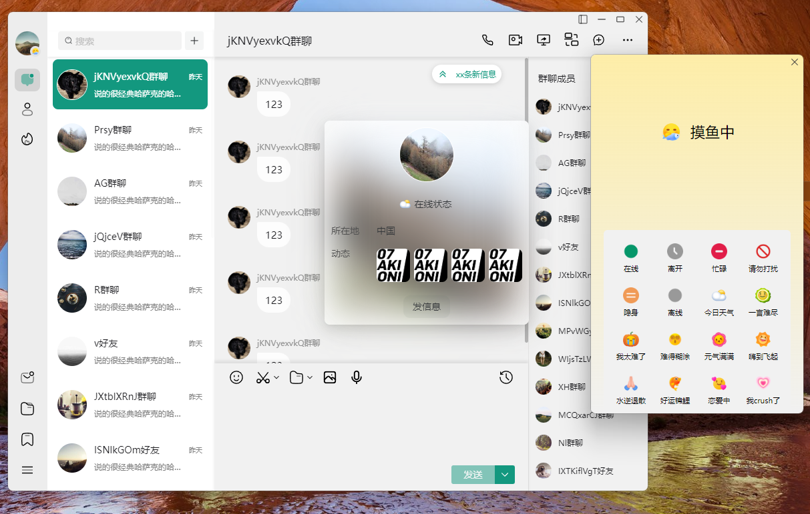
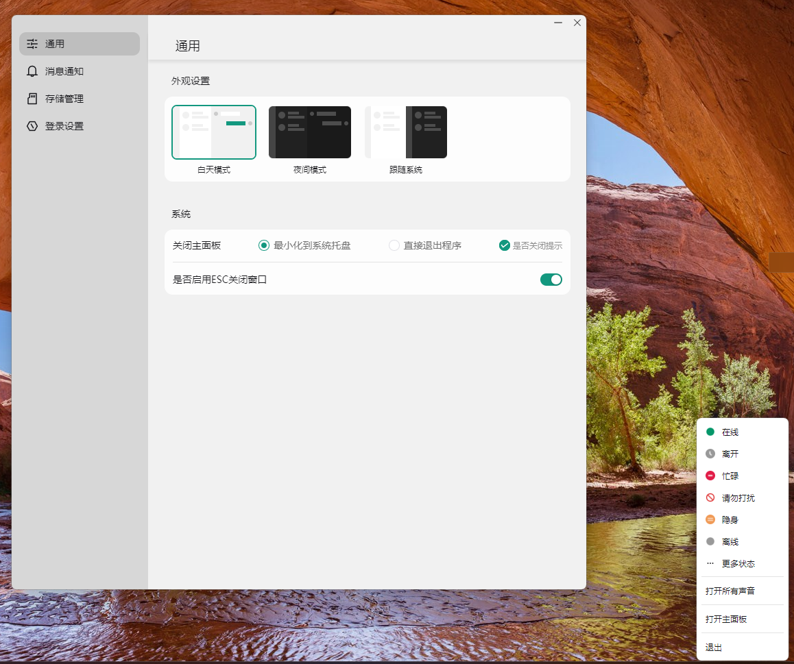
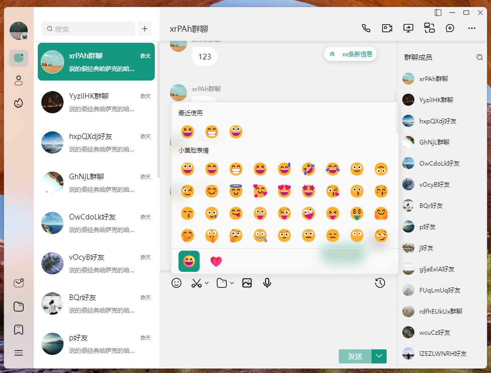

# HULA COM TAURI
👨‍🏫ESSE APLICATIVO É UM SISTEMA DE MENSAGENS INSTANTÂNEAS DESENVOLVIDO COM TAURI, VITE 5, VUE 3 E TYPESCRIPT.

 <br>
 <br>
 <br>
 <br>
 <br>

## DESCRIÇÃO:
HuLa é um sistema de mensagens instantâneas desenvolvido com Tauri, Vite 5, Vue 3 e TypeScript. Ele aproveita os recursos de plataforma cruzada do Tauri e o design reativo do Vue 3, combinados com os recursos de segurança de tipo do TypeScript e o sistema de construção rápida do Vite 5, para fornecer aos usuários uma solução de comunicação eficiente, segura e fácil de usar.

## TECNOLOGIAS:
* [Tauri:](https://github.com/VILHALVA/CURSO-DE-TAURI) Fornece um contêiner de aplicativos de desktop leve e de alto desempenho, permitindo o desenvolvimento de aplicativos de desktop multiplataforma com uma pilha de tecnologia web. A filosofia de design da Tauri visa minimizar o consumo de recursos e ao mesmo tempo garantir a segurança.
* [Vite 5:](https://vitejs.dev/blog/announcing-vite5) Uma ferramenta de construção front-end moderna que usa importação de módulo ES nativo para oferecer um servidor de desenvolvimento rápido. Ao mesmo tempo, fornece suporte robusto para compilações de produção. Vite 5 é sua versão mais recente, trazendo mais otimizações e recursos.
* [Vue 3:](https://github.com/VILHALVA/CURSO-DE-VUEJS) Uma estrutura JavaScript progressiva para construir interfaces de usuário. Sua API de composição, integração aprimorada de TypeScript e otimizações para plataformas móveis tornam o desenvolvimento de aplicativos complexos de página única mais simples e eficiente.
* [TypeScript:](https://github.com/VILHALVA/CURSO-DE-TYPESCRIPT) um superconjunto de JavaScript que adiciona um sistema de tipos à linguagem. Ele permite detectar mais erros durante o desenvolvimento e fornece melhor suporte dos editores.

## COMO USAR?
1. **Configuração do Ambiente:**
   - Instale as dependências do projeto (no diretório `CODIGO`). 
     ```bash
     npm install
     ```

2. **Execução do Projeto:**
   - Para iniciar o aplicativo em modo de desenvolvimento:
     ```bash
     npm run tauri dev
     ```

3. **Build do Projeto:**
   - Para compilar o aplicativo para produção:
     ```bash
     npm run tauri build
     ```

## CREDITOS:
- [PROJETO CRIADO PELO "nongyehong"](https://github.com/nongyehong/HuLa-IM-Tauri)
- [PROJETO EDITADO PELO VILHALVA](https://github.com/VILHALVA)


